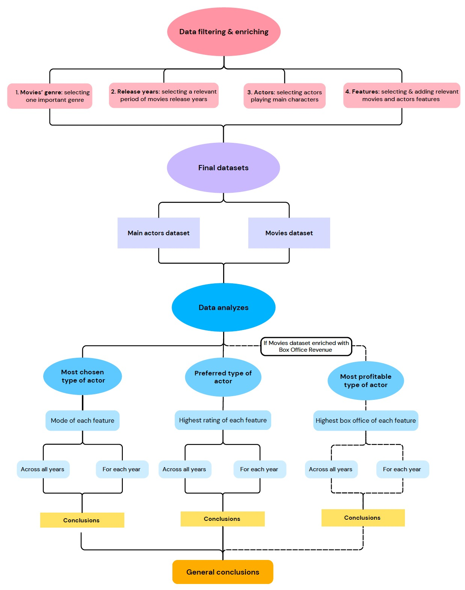

## Abstract

Main characters often drive the plot and central themes of a movie. Hence, it is interesting to concentrate our analysis exclusively on the main character and study the attributes of the actors who portray them. The goal of this data analysis project is to gain insight into the casting and viewers preferences for main characters within various movie genres. 

Firstly, we'll filter the dataset based on key criteria: prominent genre, relevant time period, main character, and pertinent features.
Next, we'll conduct two studies on the filtered dataset:
- **Mode Analysis:** Identifying the most frequently chosen actor type for main characters.
- **Preference Analysis:** Determining the audience's top-rated attributes for each character feature to discern the most preferred actor type.

In the final phase of our project, we will conduct a comprehensive cross-analysis of the outcomes from the two distinct studies to identify recurring patterns in actor preferences. 

## Research questions
- Do the viewer's preferences influence the type of main actor chosen for a certain movie genre? 
- Are there any predominant characteristics for actors chosen to portray main characters in a specific movie genre and does it evolve over time? 

## Additional datasets

**IMDb Non-Commercial Datasets:** The datasets include various aspects of movie and TV show data like titles, crew, ratings, and episode details. In this project are used datasets title.basics (basic title information), title.principals (main participants), title.ratings (user ratings), and name.basics (personnel details).

## Methods

### Data preparation 

How are the merges done !!!!!!!!!!!!!!!!!!!!!!!!!!!!!!!!!!!!!!!!!!!!!!!!!!!!!

In the data preparation phase, we conducted a thorough analysis of data types, including the transformation of dates into years, for example. Unused columns were dropped, and the remaining ones were renamed for consistency. 

An inner merge was performed between IMDB and CMU movies, based on film names and years, augmenting the dataset with ratings and IMDB IDs.  + oscars

This led to the creation of two distinct datasets: one focusing on films and another centered around actors.  

#### Dataframe 1: Movies

All movies have a unique WikiID but can have the same name or the same release year (not both at the same time), hence there are unique combinations of “name + year”

| Wiki ID | Movie name | Release year | Genres | Rating |
|---------|------------|--------------|--------|--------|
| W_ID1   | name1      | year1        | Genre1 | Rating1|
| W_ID2   | name1      | year2        | Genre2 | Rating2|
| W_ID3   | name2      | year1        | Genre3 | Rating3|

#### Dataframe 2: Main actors

The Wiki ID / IMDB ID can appear in several rows if there is more than one main character but the combination “Wiki ID + Actor ID” is unique.

| Wiki ID | IMDB ID | Actor ID | Release year | Age | Gender | Height | Number movies | Number drama movies | Number main characters played | Awards | Ethnicity |
|---------|---------|----------|--------------|-----|--------|--------|---------------|---------------------|-------------------------------|--------|-----------|
| W_ID1   | I_ID1   | A_ID1    | year1        | Age1| Gender1| Height1| NumMovies1    | NumDramaMovies1     | NumMainRoles1                 | Awards1| Ethnicity1|
| W_ID1   | I_ID1   | A_ID2    | year1        | Age2| Gender2| Height2| NumMovies2    | NumDramaMovies2     | NumMainRoles2                 | Awards2| Ethnicity2|
| W_ID2   | I_ID2   | A_ID3    | year2        | Age3| Gender3| Height3| NumMovies3    | NumDramaMovies3     | NumMainRoles3                 | Awards3| Ethnicity3|

### 4.2 Feasibility analysis

We also want to illustrate the feasibility of our intended objectives. For this aim, we conduct a meticulous examination of the database, paying particular attention to missing values (NaN). Another crucial aspect of our analysis involves the distribution of genres across films. By employing statistical tools, we aim to uncover patterns and preferences within the dataset. Specifically, we explore the prevalence of drama, a genre that holds particular significance in our research.  

### 4.3 Feature extraction

Additionally, we need to determine the character's attributes more precisely. Our focus will center on key aspects such as age, gender, number of rewards and a comprehensive exploration of experience. Experience will be defined by factors including the total number of films the character has been a part of, the variety of genres engaged in, and the overall instances where the character has held a leading role.
Using the Kaggle dataset of awards (source) we can 

theo explique comment extract les “historiques” !!!!!!!!!!!!!!!!!!!!!!!!!!!!!!!!!!!!!!!!!!!!!!!!!

### 4.4 Explore analysis: mode and preferred features

To identify the most frequently chosen features, we will examine the mode for continuous features and the highest count for discrete ones. For determining preferred features, we will calculate the mean rating of movies within a specific actor feature to identify each highest-rated feature. We will ensure the selected features are significantly popular or preferred before finalizing our choices. Finally, we will visualize the distributions of these selected features over the years and explore potential significant differences in features across different years by performing t-test analysis.

### 4.5 Cross-analysis: differences between the most chosen and highest rated actor’s features

#### 4.5.1 Data visualization

To visualize variations and parallels between the two methods, we will illustrate our observations using the following type of plot: 

 

 
 

This is an example of results and observations we could obtain: 
- From year 1 to year 5, we observe diverging trends for the most selected and highest rated features. We can conclude that the film industry doesn’t seem to choose their main actors depending on what viewers prefer.
- From year 6 to year 10, we observe converging trends for both curves meaning the film industry tends to take into account the viewer’s preferences when choosing their main actors.

#### 4.5.2 Statistical analyses 

We could perform a t-test to verify the observations made before. By looking at the p-value we could state if there are significant differences between the two distributions across all years and for specific years. In the previous example, interesting years to look at could be year 4 (highest difference) and year 10 (smallest difference).

### 4.6 Further analyses

#### 4.6.1 Most fruitful actor

A further analysis could involve conducting a third study to determine the most successful type of actor by examining the box office revenue. This analysis will help us understand which actor characteristics have the greatest impact on a movie’s financial success within the selected genre. The main challenge we encounter is the high number of missing values for this feature. Hence, we aim to conduct this analysis if we possess the time and means to enrich our database. 

#### 4.6.1 Prediction of viewers’ ratings 

Another interesting analysis could be trying to find a machine learning algorithm to predict the viewer’s ratings of a film depending on the characteristics of the main character. To do so, we will try to perform a linear regression on our data. However, it is difficult to predict by now if it will be judicious to use this method. If not, we could use other approaches such as neural networks or decision trees. Next, we'll proceed to train the chosen machine learning algorithm using a predefined training set.

### Proposed timeline

- **P3.1: Explored analysis** - until the 01/12
- **P3.2: Cross-Analysis** - until the 08/12
- **P3.3: Prediction of users rating** - until the 15/12
- **P3.4: Data-story** - from now until the 20/12
- **P3.5: Analysis with Box-Office revenue** (if enough time)

### Organization within the team

- **Armance:** Feature extraction, Data Visualisation, Feasibility analysis, README
- **Emeline:** Explore analysis, Cross-analysis, Data-story, README
- **Théo Houle:** Explore analysis, Cross-analysis, Data-story, README
- **Kelan Solomon:** Feature extraction, Data Visualisation, Feasibility analysis, README
- **Dimitri Jacquemont:** Explore analysis, Cross-analysis, Data-story, README

 
 

