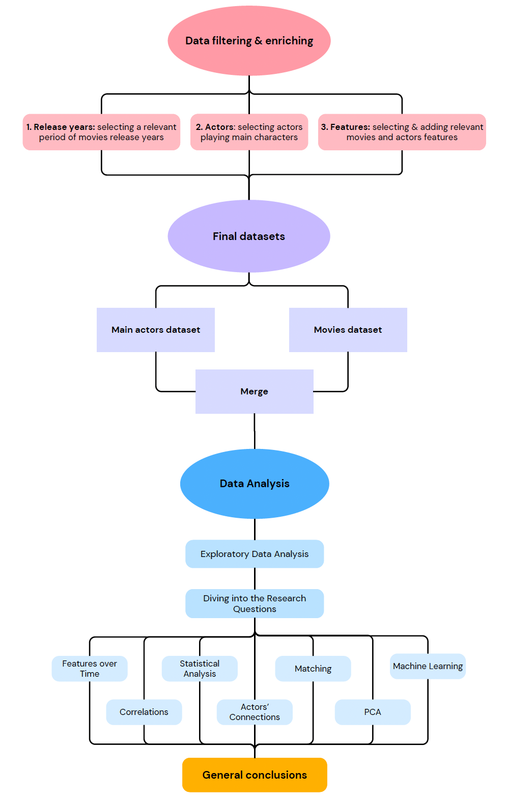

# Title 

## Abstract

Main characters often drive the plot and central themes of a movie. Hence, it is interesting to concentrate our analysis exclusively on the main character and study the attributes of the actors who portray them. The goal of this data analysis project is to gain insight into the casting and viewers’ preferences for main characters within various movie genres.

Firstly, we'll filter the dataset based on key criteria: prominent genre, relevant time period, main character, and pertinent features. Next, we'll conduct two studies on the filtered dataset:

1. **Mode Analysis:** Identifying the most frequently chosen actor’s features for main characters.
2. **Preference Analysis:** Determining the audience's top-rated attributes for each character feature to discern the most preferred actor’s features.

In the final phase of our project, we will conduct a comprehensive cross-analysis of the outcomes from the two distinct studies to identify recurring patterns in actor preferences.

## Research Questions

- Are there any predominant characteristics for actors chosen to portray main characters in a specific movie genre and does it evolve over time?

- How does the notoriety of an actor influence his likeliness to be selected for a given role? Do the viewer's preferences influence the casting? How do honors such as Oscars influence the casting? Does the number of roles prior roles? 

## Additional datasets

- **IMDb Non-Commercial Datasets**: The datasets include various aspects of movie and TV show data like titles, crew, ratings, and episode details. In this project are used datasets title.basics (basic title information), title.principals (main participants), title.ratings (user ratings), and name.basics (personnel details).
Source: https://datasets.imdbws.com/

- **Kaggle Awards Dataset**: This dataset is a scraping of the official Academy Awards listing winners and nominees between 1927 and 2023. A typical row indicates that a given actor was nominated in a given year for a given movie and whether an oscar was won or not.
Source: https://www.kaggle.com/datasets/unanimad/the-oscar-award

## Methods

### Data preparation

In the data preparation phase, we conducted a thorough analysis of data types, including the transformation of dates into years, for example. Unused columns were dropped, and the remaining ones were renamed for consistency. 

An inner merge was performed between IMDb and CMU movies, based on film names and years, augmenting the dataset with ratings and IMDb IDs.

A list of main actors was extracted from the IMDb principals dataset, and then merged with both the merged movies dataframe and Kaggle Awards dataset to add features nomination and awards.

---

### Feature extraction

From our various dataset we will retain a few selection of features. For the actors we will keep an ID (sourced from the IMDb dataset), his name, age and gender. For the movies, we keep the wikipedia ID, the IMDb ID, the movie’s title, release year, genre(s) and rating.

On top of that, we have a few additional actor features that we will engineer based on some simple statistics:
- **Awards won**: the number of academy awards won by the actor prior to this role.
- **Nominations**: similarly to the awards won but taking only nominations.
- **Previous roles**: the number of roles the actor played in prior to this role.
- **Previous roles in the same genre**: the above column filtered to keep only movies of the same genre

This will lead to the creation of our final dataset composed of two data frames.

<u>**Dataframe 1</u>: Movies**

All movies have a unique WikiID but can have the same name or the same release year (not both at the same time), hence there are unique combinations of “name + year”

| Wiki ID | Movie name | Release year | Genres | Rating |
|---------|------------|--------------|--------|--------|
| W_ID1   | name1      | year1        | Genre1 | Rating1|
| W_ID2   | name1      | year2        | Genre2 | Rating2|
| W_ID3   | name2      | year1        | Genre3 | Rating3|

**<u>Dataframe 2</u>: Main actors**

The Wiki ID / IMDB ID can appear in several rows if there is more than one main character but the combination “Wiki ID + Actor ID” is unique.

| Wiki ID | IMDB ID | Actor ID | Order | Release year | Age | Gender | Roles in movies | Roles in drama movies | Awards | Oscars Nominations |
|---------|---------|----------|-------|--------------|-----|--------|---------------|---------------------|--------|---------------------|
| W_ID1   | I_ID1   | A_ID1    | 1     | year1        | Age1| Gender1| Nomination1    | NumDramaMovies1     | Awards1| Ethnicity1          |
| W_ID1   | I_ID1   | A_ID2    | 2     | year1        | Age2| Gender2| NumMovies2    | NumDramaMovies2     | Awards2| Nomination2          |
| W_ID2   | I_ID2   | A_ID3    | 3     | year2        | Age3| Gender3| NumMovies3    | NumDramaMovies3     | Awards3| Nomination3          |

---

### Feasibility analysis

After carefully checking our merged dataset and dealing with any missing information, it was found that analyzing it is possible. The review showed that Drama is the most common movie genre, which allows us to look into 17,500 movies and a similar number of main actors. By using statistical methods, the aim is to discover patterns and preferences in the data about actors.

---
### Exploratory analysis: mode and top-rated attributes

To identify the most frequently chosen actor’s features, we will examine the mode of the data. For determining the top-rated attributes, the mean rating of movies is calculated within a specific actor attribute to identify each top-rated attribute. The distributions of these selected features will be visualized over the years to explore potential differences in value by performing t-test analysis.

### Cross-analysis: differences between the most chosen and highest rated actor’s features

1. **Data visualization**

To visualize variations and parallels between the two methods, we will illustrate our observations using the following type of plot.
This is an example of results and observations we could obtain: 

    

        <!-- Your text goes here -->

- From year 1 to year 5, we observe diverging trends for the most selected and highest-rated features. We can conclude that the film industry doesn’t seem to choose their main actors depending on what viewers prefer.
- From year 6 to year 10, we observe converging trends for both curves meaning the film industry tends to take into account the viewer’s preferences when choosing their main actors.
    

    

        
        
Figure 1: Cross Analysis

    

 

2. **Statistical analyses**

We could perform a t-test to verify the observations made before. By looking at the p-value we could state if there are significant differences between the two distributions across all years and for specific years. In the previous example, interesting years to look at could be year 4 (highest difference) and year 10 (smallest difference).

## Further analyses

###  Machine Learning approach:  prediction of viewers’ ratings 

Another interesting analysis could be trying to find a machine learning algorithm to predict the viewer’s ratings of a film depending on the characteristics of the main character. To do so, we will try to perform a linear regression on our data. However, it is difficult to predict now if it will be judicious to use this method. If not, we could use other approaches such as neural networks or decision trees. Next, we'll proceed to train the chosen machine learning algorithm using a predefined training set and test it with the testing dataset.

###  Most profitable actor

A further analysis could involve conducting a third study to determine the most profitable type of actor by examining the box office revenue. This analysis will help us understand which actor characteristics have the greatest impact on a movie’s financial success within the selected genre. The main challenge we encounter is the high number of missing values for this feature. Hence, we aim to conduct this analysis if we possess the time and means to enrich our database. 

## Project overview

 
 

## Proposed timeline

| Part   | Task                            | Deadline     |
|--------|---------------------------------|--------------|
| P2     | Data Preparation - Feasibility Analysis | done         |
| P3.1   | Feature Extraction              | 24/11        |
| P3.2   | Exploratory Analysis            | 01/12        |
| P3.3   | Cross-Analysis                  | 08/12        |
| P3.4   | Machine Learning                | 15/12        |
| P3.5   | Data Story                      | 20/12        |
| P3.6   | Most Profitable Actor           | if enough time |

## Organization within the team

- **Armance**: Feature extraction, Data Visualisation, Feasibility analysis, README

- **Emeline**: Explore analysis, Cross-analysis, Machine Learning, Data-story

- **Théo Houle**: Explore analysis, Cross-analysis, Data-story, README

- **Kelan Solomon**: Feature extraction, Data Visualisation, Machine Learning, Feasibility analysis

- **Dimitri Jacquemont**: Explore analysis, Cross-analysis, Machine Learning, Data-story

