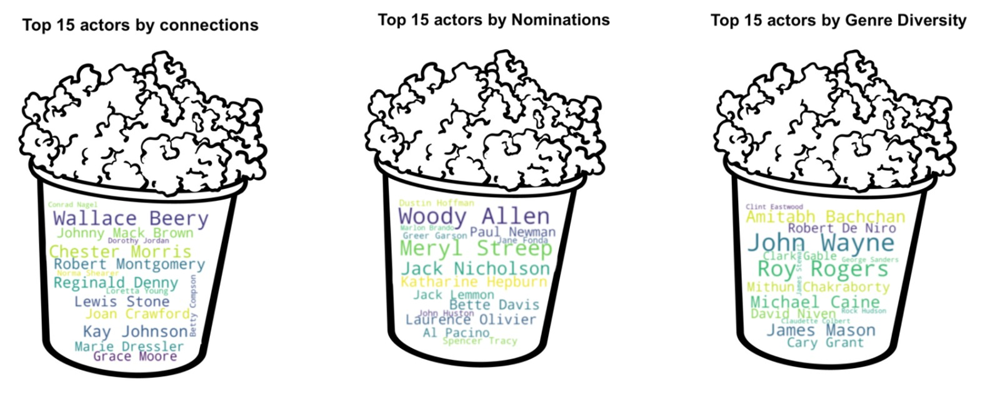
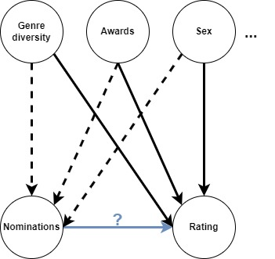

- Toc
{:toc}

# Introduction & Research Questions

The quest for creating a captivating and memorable movie has captivated filmmakers and audiences alike for decades. The question of what makes a good movie remains a perpetual mystery, with numerous factors contributing to the overall cinematic experience. From the director's vision and the harmonious blend of music to the chosen genre, the elements at play are diverse and interconnected. In this analysis, however, we embark on a focused exploration, focusing on a particular aspect of the cinematic universe: the actors. Looking into the three main characters of a movie allows us to conduct a different analysis, perhaps closer to reality than examining all the characters. Take "James Bond," for example, while there are plenty of side characters they tend to stay in the background. Analyzing all characters might give us features that differ from the true spirit of the movie. Focusing on the main characters is like peeling back the layers to reveal what the movie's all about.

As we dive into the vast realm of film ratings, our inquiry takes shape around a pivotal question: Is there a pattern that distinguishes main actors in well-rated movies from those in poorly-rated ones? In simpler terms, do viewers exhibit a preference for certain types of main actors, and can we uncover a correlation between an actor's presence and the overall success of a film? 

To answer this question we will be looking at the following points:
- Can an actor's success in terms of awards and nominations impact the ratings of the movies in which they appear?
- Do viewers tend to rate higher movies in which prolific actors appear?
- How do the connections between actors influence the ratings of the movies they are in?
- Does physical atributes of actors in terms of age and gender influence the ratings of the movies they play?

# Building our Dataset

While raw data is already gathered, it's not yet ready for analysis due to potential imperfections, complexities, and missing values. The clarity and accuracy of our findings directly depend on the quality of our data - a classic case of “garbage in, garbage out”.

## Data Sources

We used the Movie Summaries dataset provided by the course alongside the extensive IMDb dataset, which offers supplementary information on movies and actors. A pivotal element of our study was the Academy Awards Database. This comprehensive record details past Academy Award winners and nominees from 1927 to 2023.

## Understanding our data

In our data preparation process, we streamlined the dataset for optimal analysis. The first step involved standardizing date formats to years only, fitting our analytical requirements. We then proceeded to remove unused features and titles from the IMDb database that were not classified as movies. Duplication was another area we addressed, ensuring the uniqueness of our dataset.

    

After looking at the completeness of our data, the rows with critical missing values to our analysis were removed. Filters based on movie runtime were also applied, restricting our focus to films with durations between 20 and 200 minutes, and release dates from 1930 to 2012. These steps collectively sharpened our dataset, making it well-suited for the analysis ahead.

## Feature Engineering

In our feature engineering phase, we focused on enhancing our dataset with actor-centric attributes based on the 3 main actors to deepen our analysis:

- Counting the number of awards and nominations each actor had accumulated up until the year of the movie’s release.
- Calculating the total number of movies each actor had appeared in up until the movie in question.
- Assessing the diversity of an actor's roles by counting the number of different genres they had worked in up until that point.
- Looking at the actor connections and their influence in the node graph
- Average IMDb movie rating in which the actor has played
- The decade in which the movie was released

We had a look at the connections between actors by constructing a network graph. To do this we created a bipartite graph between actors and movies and then projected it onto the actors. We then could calculate the eigenvector centrality to measure the influence of an actor in the network. The following graph displays this centrality after filtering out the “non-influential” actors for readability reasons.

    

These enhancements were crucial in providing a more nuanced understanding of an actor's experience, versatility, and recognition in the industry, contributing to a more comprehensive analysis of their impact on the movies they were part of. After the filtering of our data, we can observe that we have significantly reduced the number of films in our dataset. However, the distribution of the movies filtered is similar to the all movies with IMDb scores.

    

# Exploratory Data Analysis

## Datasets Overiew

In our dataset, we've collected and combined key actor attributes. Our analysis will focus on examining the following actors features: 

- Age at release: the age of the actor at the time of the release of the movie
- Is male: binary indicator representing whether the actor is male (True) or not (False)
- Movie count: the total number of movies in which the actor has appeared
- Actor connections: the importance of the node in the actor connection graph
- Genre diversity: measure of the variety of movie genres in which the actor has participated
- Nominations: the total number of award nominations received by the actor
- Awards: the total number of awards won by the actor
- Average rating: Average IMDb movie rating in which the actor has played
- Is good: binary variable that indicates whether a film is considered high-rated or low-rated based on a predefined threshold
- Movie release year range: the decade in which the movie was released
- Primary Name: the name and surname of the actor

This dataset provides a comprehensive foundation for our analysis, offering valuable insights into the dynamics of the film industry and the impact of actors on cinematic success.

## Evolution of Features over time

Let's first have a look at the mean of our features over time, to get a general grasp of their trends.

    

- **Awards**: We can observe a maximum average number of awards per actor in the 1950’s, followed by a long-term decrease over the decades. This observation could be due to an increased number of actors over time, which makes it more difficult to obtain an award. Note that the average awards are so low (between 0.02 and 0.07) as very few actors have awards
- **Nominations**: The same observation can be made about the average number of nominations as this plot follows the same trend as the awards.
- **Movie count**: We can observe a maximum peak in the 1940s followed by a sharp decrease until the 1980’s. Actors in earlier decades may have participated in more movies, which has since stabilised.
- **Diversity of genres**: The same observation can be made about the diversity of actors' participation in movie genres, as this plot follows the same trend as the movie count.
- **Gender (Is Male)**: The film industry appears to have been and continues to be male-dominated, although the data suggests a small shift towards more gender diversity.
- **Age at release**: The average age of actors has a peak in the 1970s, but the plot doesn’t show a clear trend of becoming younger or older over the decades. 
- **Actor Connections**: There is a steep decline in the average value of actor connections from the 1930s onward. Earlier actors may have had more connections within the industry, which could suggest a tighter-knit community or a smaller industry at the time.

## Correlation between features

We saw previously that some of our features seem to follow similar trends throughout time. Let’s have a look to see if there are any significant correlations.

    

First, this matrix indicates that movie count and genre diversity exhibit a very high positive correlation (0.87), suggesting that prolific actors have a significant presence in a wide range of genres. Another high correlation can be observed between awards and nominations (0.71). 

The connections an actor makes tend to be higher when the actor is prolific, as suggested by the moderate correlations actor_connections has with movie_count (0.53) and genres_diversity (0.50). We can notice that except for a weak correlation with age at release, the gender of an actor is not correlated to the features, meaning the success and experience of an actor doesn’t depend on their gender. All the other correlations are weak or null.
These correlations explain the matching trends observed between awards and nominations, as well as movie_count and genre_diversity in [previous section](#evolution-of-features-over-time).

# Deep Dive into Analysis

To eliminate the influence of “medium” films,  we have chosen to take the 30th upper and lower percentiles of movies to define well rated and poorly rated movies. This reduces our dataset but allows us to better distinguish a good IMDb rating from a bad one. We have also binned our data into decades, allowing us to analyse a general trend rather than spikes in individual years.

## Correlation of Features with Ratings

Firstly, we should confirm whether or not the actor features we've identified do indeed correlate with the IMDb film rating.

    

The feature with the highest correlation is actor connections, followed by nominations and genre diversity. It is however important to note that the correlations are not very large, topping out at 0.15.

## Well-rated and poorly-rated movies over time by feature

    

These plots suggest there are observable differences in the features of actors between high and low-rated movies. Specifically, actors in higher-rated movies have a history of more awards and nominations, have appeared in more movies, and have had experience across a wider range of genres before the current movie. These findings indicate that actors' experience and recognition (in terms of awards and variety of roles) may correlate with the ratings of the movies they are in. Let’s investigate the features' evolutions in more detail.

**Awards, nominations, movie count and genre diversity**

The first thing to note is that these four features are always statistically significant no matter the year. They all have substantial differences between well-rated and poorly-rated movies before the 1980s. After this, there is a slight converging trend that could be due to the large number of actors and diversity of movies, that there are today.

**Is male and age at release**

Not much can be concluded from these graphs due to the lack of statistical significance.

**Actor connections**

The first thing that stands out from this graph is the extremely low confidence interval. This feature has statistical significance into the late 1970s and after this both lines become indistinguishable.

## Correlation of Features with ratings over the years

Now that we have had a look at the temporal graphs, we know that the correlations between actor features and average ratings shown previously are probably not accurate over all years. Let’s have a look at the correlations throughout the decades.

    

The same features stand out, actor connections has a high correlation, especially at the start of the 20th century. Nominations also has a high correlation over the years and so does genre diversity. Now that we have found the influential features, we will continue this analysis by looking at each feature individually. One important thing to take from this graph is the reduction in general correlation over the years, this means that the features that we have collected have a smaller influence today than they did 8 decades ago. 

## Features Analysis

We will now analyse more specifically the most influential actor’s features impacting the ratings. As awards and nominations are highly correlated, we will focus more closely on nominations as it has a higher correlation with ratings. Finally,  between genre_diversity and movie_count, which are also highly correlated,  we will be concentrating on  genre_diversity due to its higher general correlation. 

### Top 15 actors in connections, nominations, and genre diversity

In the following word clouds, we can observe the top 15 actors for the three features mentioned above. This can be considered a sanity check to be sure that our 3 most influential features are not tied to the same actors which would influence our analyses.

### Nominations

    

Here we are plotting the average nominations/awards won per rating. We can observe a very slight increase in nominations and awards won as the rating increases meaning that films with high ratings generally have more awards and nominations. Unfortunately, these features are too sparse in the higher film ratings, hence the high confidence interval.

    

These two plots show that there is indeed a difference in movie ratings in terms of awards and nominations received. In other words, actors with awards and nominations generally play in better-rated movies. 
 
On the nominations plot, the confidence interval explodes after 6 nominations due to sparse data, however before that, we can see an important increasing trend.
 
Another interesting observation is that we can distinguish films with and without nominations, as having more than one nomination is not statistically significant.

To simplify our dataset we will add two columns: 

- **has award**:  binary indicator that indicates whether a movie has received an award (True) or not (False)
- **has nomination**: binary indicator that indicates whether a movie has received a nomination (True) or not (False)

Since the amount of nominations/awards has little influence as long as it is above 0. 

### Chi-square

To check if the rating and nominations are associated or not, we are performing a Chi-square test since our value is categorical. These are our hypothesis:

Null hypothesis (H0):
- The proportion of nominations between high-rated and low-rated movies is equal. There is no association between the ratings of a movie and the number of nominations received by the actors who play in it 

Alternative hypothesis(Ha):
- The proportion of nominations won between high-rated and low-rated movies is not equal. There is a significant association between the ratings and the number of nominations received by the actors who play in it.

Results: χ² = 988, p-value = 5.4e-217

We can observe an extremely low p-value, much smaller than 0.05. It leads us to the rejection of the null hypothesis and suggests that there is a significant association between the nominations and the ratings of a movie. This extremely low value could be explained by the very large sample size that we have. Even small deviations from the null hypothesis may result in extremely low p-values and the p-value might be statistically significant but not practically significant. 

### Matching

To check that it is indeed the nomination that influences the rating and not some confounder we will apply matching. Since we have varying data, we will be matching on closeness, for example, we have set a closeness of 3 for the age, therefore an actor of 33 years old can be matched with an actor of 30.

The following causal diagram shows that there are multiple possible confounders on the nominations.

The logistic regression before the matching shows that having a nomination significantly increases the chances of playing in high-rated movies. The log odds ratios predicted are -0.14 for the intercept and 0.98 for the has_nomination. These coefficients have p-values of 0.000, which suggests that both are statistically significant predictors of the outcome variable. In terms of probabilities, these results mean that when an actor doesn’t have nominations, the probability of playing in a high-rated movie is 46%, while having a nomination increases the probability to 70%. The Pseudo R-squared value is 0.015, which is a bit low, indicating that the model doesn't explain a large portion of the variance in the outcome.

**Logistic regression after matching**

The logistic regression after the matching shows slightly different results. The log odds ratios predicted are -0.11 for the intercept and 0.8 for the has_nomination. These coefficients have p-values of 0.17 and 0.00 respectively, which suggests that only the second one is a statistically significant predictor of the outcome variable. In terms of probabilities, these results mean that when an actor doesn’t have nominations, the probability of playing in a high-rated movie is 47%, while having a nomination increases the probability to 67%. The Pseudo R-squared value is 0.024.

In summary, after matching, the model indicates that having a nomination still significantly increases the likelihood of playing in high-rated movies. Still, the magnitude of this effect is slightly less than what was initially estimated. This means that due to confounders, the initial model overestimated the effect having a nomination has on the ratings of movies. The baseline probability slightly changed, and the model fit has improved, suggesting the matching process allowed a better fit of the data.

### Actors Connections

Now let's continue looking at our features by analyzing the actor connections. 

    

As we can see, our distributions are not normal and we can therefore not apply a t-test. We can however use a [Mann–Whitney U](https://en.wikipedia.org/wiki/Mann%E2%80%93Whitney_U_test)  test as we can assume that
- All the observations from both groups are independent of each other
- The responses are at least ordinal (i.e., one can at least say, of any two observations, which is the greater)
- Under the null hypothesis H0, the distributions of both populations are identical.
- The alternative hypothesis H1 is that the distributions are not identical.

With a Mann Whitney u p-value of 1.18e-86, we can see from this test that the actor’s connections feature is indeed statistically significant. 

### Genre diversity

    

We can see that there is a slight difference in these two distributions, but are they significant? We can apply an identical reasoning to genre diversity. The Mann-Witney test also gives a low p-value (3.84e-160), implying its statistical significance.

### Overall analysis

Now that we have had a look at the important actor features, let's see if we can visualise a difference between actors who play in highly rated movies and ones who play in poorly rated movies. To do this we first must do a PCA on our data, this allows us to plot multiple features on a 2D plot. 

    

Unfortunately, we can’t see any evident clusters in this graph. But this was expected as we saw that the period of the film plays a large role. Let's have a look at the different decades!

    

The first thing that stands out is the difference in the shape of these plots. In earlier years, the points are more scattered and become grouped as the years go on. This may be due to the reduction of correlation in more recent years as seen before:  as our features have less and less influence, the more grouped the points become.

Having a closer look, we can see that in the first 3 decades, the actors who played in lower-rated movies are more concentrated around the main cluster. As the years go on, the distribution of poorly rated movies is becoming similar to the distribution of actors in well-rated movies, so much so that in 2000 -2010  it’s hard to see any difference in these distributions. This reflects what was stated previously in this analysis: our features have a higher importance in earlier years.

# Machine Learning

So far we have seen that there is indeed a difference in actor features between extreme movie ratings, the question is: is it possible to use machine learning to classify films into “Good” and “Bad” movies? To do this we will use a Random Forest Classifier as it excels in dealing with complex and varied data. Its ability to manage outliers and reveal key influencing features made it a more suitable choice for our movie data, compared to simpler models like logistic regression.

Our model was trained on the most influential features to distinguish well-rated movies from poorly rated ones. These include the actors' industry connections, their experience across various genres, the number of nominations they have received, and their filmography volume. We trained our classifier on 70% of our dataset, using the remaining 30% to test and evaluate the model's predictive capabilities. Additionally, we employed Grid Search for optimal parameter tuning.

Interestingly, the model's effectiveness seems to significantly rely on the actors' connections, which held a pronounced impact on the predictions. However, our evaluation metrics indicate that while the model fits the training data to some extent, it has a hard time predicting a movie's success based solely on its cast.

    

The following results indicate that the random forest classifier is somewhat better at identifying actors playing in poorly rated movies (instance of class 0) than actors playing in well rated movies (instance of class 1). The overall accuracy is moderate (0.59), and there's a significant difference in recall between the two classes, which could indicate a potential area for model improvement, especially in correctly identifying more instances of highly rated movies.

|            | precision | recall | f1-score | support |
|------------|-----------|--------|----------|---------|
| 0          | 0.58      | 0.73   | 0.65     | 7387    |
| 1          | 0.61      | 0.45   | 0.52     | 6977    |
| accuracy   |           |        | 0.59     | 14364   |
| macro avg  | 0.60      | 0.59   | 0.58     | 14364   |
| weighted avg | 0.60    | 0.59   | 0.59     | 14364   |

If we try to predict the outcome for years only before 1950, we can see that we get a slightly better outcome. In fact, the precision at identifying actors playing in well-rated and poorly-rated movies has increased. The overall accuracy is also better (0.65 instead of 0.59).
These observations align with our previous findings.

|            | precision | recall | f1-score | support |
|------------|-----------|--------|----------|---------|
| 0          | 0.63      | 0.72   | 0.67     | 1106    |
| 1          | 0.67      | 0.58   | 0.62     | 1087    |
| accuracy   |           |        | 0.65     | 2193   |
| macro avg  | 0.65      | 0.65   | 0.65     | 2193   |
| weighted avg | 0.65    | 0.65   | 0.65     | 2193   |

Further analysis could involve exploring additional features or different machine learning algorithms. For instance, incorporating directorial or production-related variables might enhance the model's predictive power. Alternatively, experimenting with other classification methods like Support Vector Machines or Neural Networks could offer new insights into the complex dynamics of movie success prediction.

# Conclusion

In conclusion, our exploration into the relationship between actor features and movie ratings has shown valuable insights. The ability to distinguish between actor features in high-rated and low-rated movies implies a pattern that could contribute to the overall success of a film. Interestingly, this distinction is slightly more pronounced in older movies, suggesting an evolving landscape in recent years where actor features in high-rated and low-rated movies display greater similarity. This shift may reflect changing viewer preferences or evolving cinematic trends. The exploration of awards and nominations, the influence of actors, and the impact of actor’s connections on movie ratings all contribute to a nuanced understanding of the intricate dynamics within the realm of cinema. However, it is crucial to acknowledge the complexities of attributing success solely to actor features. Numerous factors, such as the director's vision, screenplay, and cultural context, also significantly influence a movie's reception. Moreover, our analysis is subject to limitations, and achieving a definitive correlation is challenging as we have seen with our PCA analysis. A more extensive dataset or comparison with IMDb scores, which incorporate additional metrics, could offer a more nuanced and precise understanding. As we conclude this analysis, it becomes evident that actor features play a role in shaping viewer perception, yet cinematic success involves a multitude of factors extending beyond the realm of individual actors.